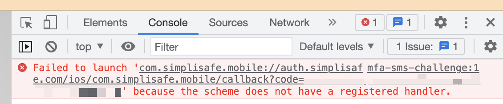
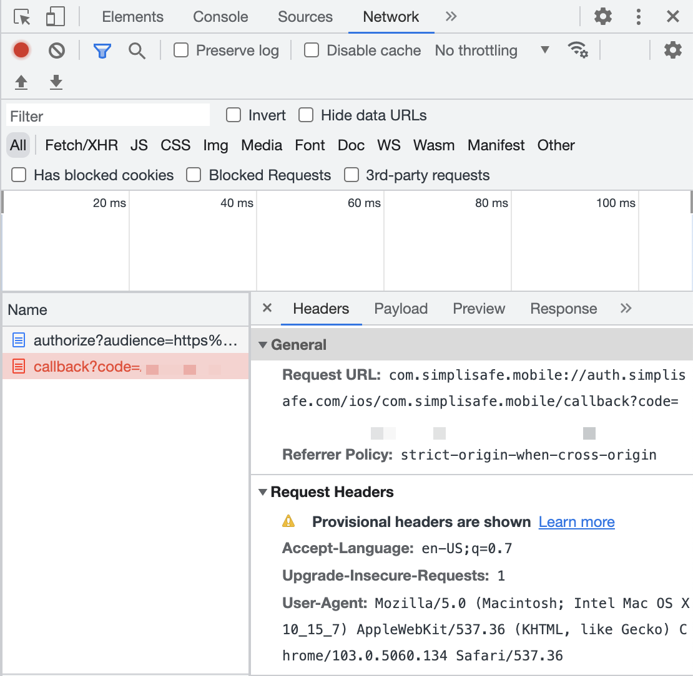

# Usage

## Installation

```bash
pip install simplisafe-python
```

## Python Versions

`simplisafe-python` is currently supported on:

- Python 3.9
- Python 3.10
- Python 3.11

## SimpliSafe™ Plans

SimpliSafe™ offers several [monitoring plans](https://support.simplisafe.com/hc/en-us/articles/360023809972-What-are-the-service-plan-options-).
Only the **Standard** and **Interactive** plans work with this library.

Please note that only Interactive plans can access sensor values and set the system
state; using the API with a Standard plan will be limited to retrieving the current
system state.

## Accessing the API

Starting in 2021, SimpliSafe™  began to implement an OAuth-based form of authentication.
To use this library, you must handshake with the SimpliSafe™  API; although this process
cannot be fully accomplished programmatically, the procedure is relatively
straightforward.

### Authentication

`simplipy` comes with a helper script to get you started. To use it, follow these
steps from a command line:

1. Clone the ``simplipy`` Git repo and `cd` into it:

```sh
$ git clone https://github.com/bachya/simplisafe-python.git
$ cd simplisafe-python/
```

2. Set up and activate a Python virtual environment:

```sh
$ python3 -m virtualenv .venv
$ source .venv/bin/activate
```

3. Initialize the dev environment for ``simplipy``:

```sh
$ script/setup
```

4. Run the ``auth`` script:

```sh
$ script/auth
```

5. Hit the Enter key to open a web browser to the SimpliSafe login page:


6. Once you enter your username/password and click "Continue", you will receive a
   two-factor authentication request. Depending on your account settings, this will
   arrive as either (1) an SMS text message or (2) an email. Follow the provided
   instructions regardless of which form you receive. Once you complete the
   verification, return to the browser and open its Dev Tools window. Look for an error
   (in either the Console or Network tab) that contains a URL starting with
   `com.simplisafe.mobile`:
```
com.simplisafe.mobile://auth.simplisafe.com/ios/com.simplisafe.mobile/callback?code=<CODE>
```



(Note that if you have already logged into SimpliSafe via the browser, you may be sent
straight to the end of the process. This can present a challenge, since opening Dev
Tools in that window won't show the previously logged activity. In this case, open a new
tab, open its Dev Tools window, then copy/paste the URL from the tab opened by
`script/auth` into the new tab to see the Console/Network output.)

7. Copy the `code` parameter at the end of the `com.simplisafe.mobile` URL, return to your
terminal, and paste it into the prompt. You should now see this message:

```sh
You are now ready to use the SimpliSafe API!
Authorization Code: <CODE>
Code Verifier: <VERIFIER>
```

These values can now be used to instantiate an {meth}`API <simplipy.api.API>` object.
Remember that this Authorization Code and Code Verifier pair (a) can only be used once
and (b) will expire after a relatively short amount of time.

### Creating an API Object

Once you have an Authorization Code and Code Verifier, you can create an API object like
this:

```python
import asyncio

from aiohttp import ClientSession
import simplipy


async def main() -> None:
  """Create the aiohttp session and run."""
  async with ClientSession() as session:
      simplisafe = await simplipy.API(
          "<AUTHORIZATION_CODE>",
          "<CODE_VERIFIER>",
          session=session,
      )

      # ...


asyncio.run(main())
```

### Key API Object Properties

The {meth}`API <simplipy.api.API>` object contains several sensitive properties to be
aware of:

```python
# Return the current access token:
api.access_token
# >>> 7s9yasdh9aeu21211add

# Return the current refresh token:
api.refresh_token
# >>> 896sad86gudas87d6asd

# Return the SimpliSafe™ user ID associated with this account:
api.user_id
# >>> 1234567
```

Remember three essential characteristics of refresh tokens:

1. Refresh tokens can only be used once.
2. SimpliSafe™ will invalidate active tokens if you change your password.
3. Given the unofficial nature of the SimpliSafe™ API, we do not know how long refresh
   tokens are valid – we assume they'll last indefinitely, but that information may
   change.

### Creating a New API Object with the Refresh Token

It is cumbersome to call
{meth}`API.async_from_auth <simplipy.api.API.async_from_auth>` every time you want a new
{meth}`API <simplipy.api.API>` object. Therefore, *after* initial authentication, call
{meth}`API.async_from_refresh_token <simplipy.api.API.async_from_refresh_token>`,
passing the {meth}`refresh_token <simplipy.api.API.refresh_token>` from the previous
{meth}`API <simplipy.api.API>` object. A common practice is to save a valid refresh
token to a filesystem/database/etc. and retrieve it later.

```python
import asyncio

from aiohttp import ClientSession
import simplipy


async def async_get_refresh_token() -> str:
    """Get a refresh token from storage."""
    # ...


async def main() -> None:
    """Create the aiohttp session and run."""
    async with ClientSession() as session:
        refresh_token = await async_get_refresh_token()
        api = await simplipy.API.async_from_refresh_token(
            refresh_token, session=session
        )

        # ...


asyncio.run(main())
```

After a new {meth}`API <simplipy.api.API>` object is created via
{meth}`API.async_from_refresh_token <simplipy.api.API.async_from_refresh_token>`, it
comes with its own, new refresh token; this can be used to follow the same
re-authentication process as often as needed.

### Refreshing an Access Token During Runtime

In general, you do not need to worry about refreshing the access token within an
{meth}`API <simplipy.api.API>` object's normal operations; if an
{meth}`API <simplipy.api.API>` object encounters an error that indicates an expired access token, it will automatically attempt to use the refresh token it has.

However, should you need to refresh an access token manually at runtime, you can use the
{meth}`async_refresh_access_token <simplipy.api.API.async_refresh_access_token>` method.

### A VERY IMPORTANT NOTE ABOUT TOKENS

**It is vitally important not to let these tokens leave your control.** If
exposed, savvy attackers could use them to view and alter your system's state. **You
have been warned; proper storage/usage of tokens is solely your responsibility.**
