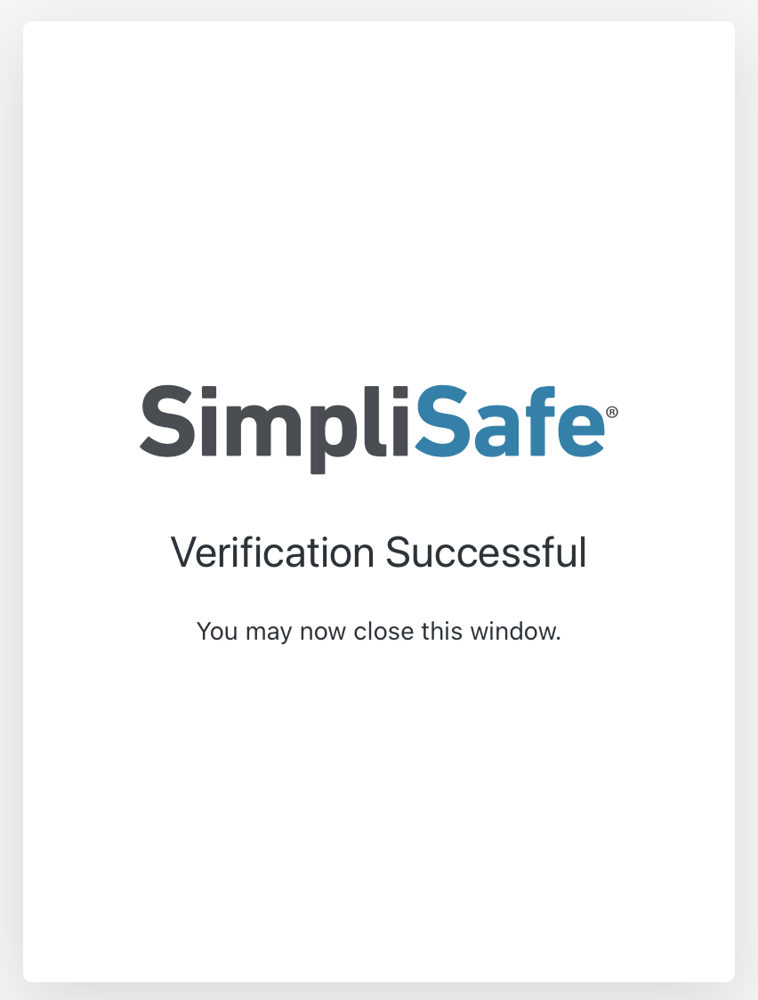

Usage
=====

Installation
------------

.. code:: bash

   pip install simplisafe-python

Python Versions
---------------

``simplisafe-python`` is currently supported on:

* Python 3.8
* Python 3.9
* Python 3.10

SimpliSafe™ Plans
-----------------

SimpliSafe™ offers several `monitoring plans <https://support.simplisafe.com/hc/en-us/articles/360023809972-What-are-the-service-plan-options->`_. Only the **Standard** and **Interactive** plans work with this library.

Please note that only Interactive plans can access sensor values and set the
system state; using the API with a Standard plan will be limited to retrieving
the current system state.

Accessing the API
-----------------

Starting in 2021, SimpliSafe™  began to implement an OAuth-based form of authentication.
To use this library, you must handshake with the SimpliSafe™  API; although this process
cannot be 100% accomplished programmatically, the procedure is fairly straightforward.

Authentication
**************

``simplipy`` comes with a helper script to get you started. To use it, follow these
steps from a command line:

1. Clone the ``simplipy`` Git repo and ``cd`` into it:

.. code:: bash

    $ git clone https://github.com/bachya/simplisafe-python.git
    $ cd simplisafe-python/

2. Set up and activate a Python virtual environment:

.. code:: bash

    $ python3 -m virtualenv .venv
    $ source .venv/bin/activate

3. Initialize the dev environment for ``simplipy``:

.. code:: bash

    $ script/setup

4. Run the ``auth`` script:

.. code:: bash

    $ script/auth

5. This will open your browser to a SimpliSafe™ login page. Once you log in with your
   credentials, you will see a "Verification Pending" webpage (we'll call this
   ``Tab 1``):

6. You will be prompted to verify your account. Depending on what you have configured in
   your SimpliSafe™ account, this could take the form of an email or an SMS:

.. image:: images/ss-verification-email.png
   :width: 400

7. Once you click the "Verify Device" link, a new browser tab (``Tab 2``) will open
   and notify you that the verification is successful:

8. Return to ``Tab 1``. You need to find an authorization code; the location of this
   code will be different depending on which browser you use:

   * Safari: ``Develop -> Show Web Inspector -> Network Tab`` (look for a reference to ``ErrorPage.html``)
   * Edge: ``Developer -> Developer Tools -> Console Tab`` (look for a ``Failed to launch`` error)
   * Chrome: ``Developer -> Developer Tools -> Console Tab`` (look for a ``Failed to launch`` error)

   Look for a reference to a SimpliSafe™ iOS URL (starting with with
   ``com.simplisafe.mobile``) and note the ``code`` parameter at the very end:

.. code::

   com.simplisafe.mobile://auth.simplisafe.com/ios/com.simplisafe.mobile/callback?code=<CODE>

9. Copy the ``code`` parameter, return to your terminal, and paste it into the prompt.
   You should now see this message:

.. code::

   You are now ready to use the SimpliSafe API!
   Authorization Code: <CODE>
   Code Verifier: <VERIFIER>

These one-time values are now ready to be used to instantiate an
:meth:`API <simplipy.api.API>` object.

Creating an API Object
**********************

Once you have an Authorization Code and Code Verifier, you can create an API object like
this:

.. code:: python

    import asyncio

    from aiohttp import ClientSession
    import simplipy

    async def main() -> None:
        """Create the aiohttp session and run."""
        async with ClientSession() as session:
            api = await simplipy.API.async_from_auth(
                "<AUTHORIZATION_CODE>",
                "<CODE_VERIFIER>",
                session=session,
            )

            # ...

    asyncio.run(main())

**REMINDER:** this Authorization Code and Code Verifier can only be used once. 

Refreshing the Access Token
***************************

The official way to create an :meth:`API <simplipy.api.API>` object after the initial
Authorization Code/Code Verifier handshake is to use the refresh token to generate a new
access token:

.. code:: python

    import asyncio

    from aiohttp import ClientSession
    import simplipy

    async def main() -> None:
        """Create the aiohttp session and run."""
        async with ClientSession() as session:
            api = await simplipy.API.async_from_refresh_token(
                "<REFRESH_TOKEN>"
                session=session,
            )

            # ...

    asyncio.run(main())

Where does the refresh token come from? When the :meth:`API <simplipy.api.API>` is first
created by :meth:`async_from_auth <simplipy.api.API.async_from_auth>`, it comes with a
``refresh_token`` property:

.. code:: python

    # Return the street address of the system:
    api.refresh_token
    # >>> abcde1234

The common practice is to store ``api.refresh_token`` somewhere (a filesystem, a
database, etc.), retrieve it later when needed, and pass it to
:meth:`async_from_refresh_token <simplipy.api.API.async_from_refresh_token>`. Be aware
that refresh tokens can only be used once!

After a new :meth:`API <simplipy.api.API>` object is created via 
:meth:`async_from_refresh_token <simplipy.api.API.async_from_refresh_token>`, it comes
with its own, new refresh token; this can be used to follow the same re-authentication
process into perpetuity.

Note that you do not need to worry about refreshing the access token within an
:meth:`API <simplipy.api.API>` object's normal operations (if, for instance, you have an
application that runs for longer than an access token's lifespan); that is handled for
you transparently.
